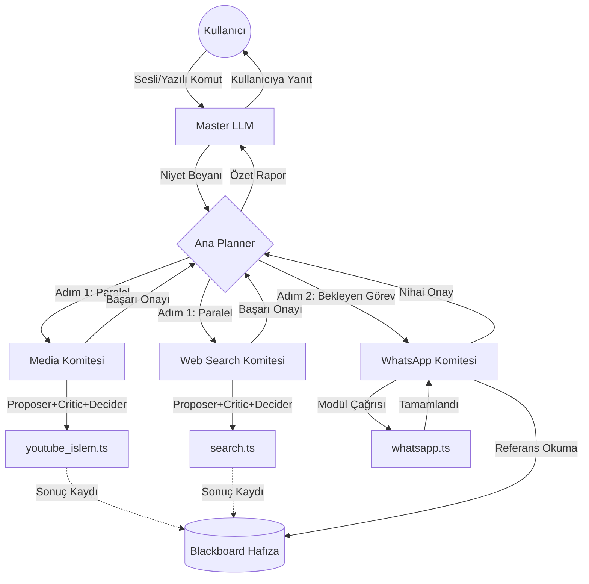

# Asker Motoru — Otonom Kovan (Hierarchical Swarm) Mimarisi

Bu belge, "Asker Motoru" kovanının **Ana Planner ➔ Şube Komiteleri (Domain AIs) ➔ Modüller (Tools)** şeklindeki yeni otonom operasyon dizilimini standartlaştırmak için tasarlanmış nihai vizyon ve uygulama planıdır. Bu yapı; halüsinasyonu sıfırlamak, modülerliği artırmak ve paralel işlem (Asynchronous Swarm) yeteneğini sisteme kazandırmak için oluşturulmuştur.

## 1. Mimari Katmanlar ve Sorumluluklar

Sistem 4 ana katmana (Layer) ayrılacaktır:

### 1.1. Master LLM (Arayüz Temsilcisi)
Kullanıcının doğal dilini anlayan, konuşan ve arayüzdeki chat ekranına cevap veren en üst yüz. Sadece sohbet eder, aksiyon almaz. Aksiyon gerektiğinde "Niyet Beyanı" oluşturup **Ana Planner**'a gönderir.

### 1.2. Ana Planner (Orkestratör / Albay)
**Asla doğrudan modül çalıştırmaz.** Sadece kendisine gelen niyet beyanını **Adımlara (DAG - Yönlü Asiklik Grafik)** böler. 
- *Örnek Plan:* 
  - Adım 1 (Media Yapısı): YouTube'dan videoyu indir.
  - Adım 2 (Transkript Yapısı): İnen videonun sesini metne dök.
  - Adım 3 (WhatsApp Yapısı): Çıkan metni X kişisine gönder.

### 1.3. Yapılar (Domain AIs / Şube Komiteleri)
Belirli bir alanda uzmanlaşmış departmanlardır. Ancak tek bir ajandan değil, **3 Kişilik Bir Ajan Komitesinden** oluşurlar (Agentic Debate Model).
- **Proposer (Tasarımcı):** Ana Planner'dan gelen görevi nasıl çözeceğine dair ilk fikri/kodu yazar.
- **Critic (Eleştirmen):** Tasarımcının fikrindeki açıkları, hataları veya riskleri arar ve karşıt fikir sunar.
- **Decider (Hakem/Karar Verici):** İki fikri dinler, sentezler ve nihai kararı vererek altındaki **Modülleri** çalıştırır.
- *Örnek Yapılar:* `Media_Committee`, `System_Committee`, `Vision_Committee`

### 1.4. Modüller (Tools / İşçiler)
`src/modules/` altındaki deterministik (kural tabanlı) TypeScript kodlarıdır. İçlerinde yapay zeka yoktur, sadece API çağrısı, dosya okuma veya Playwright otomasyonu yaparlar.

---

## 2. İletişim Protokolü: Kovan Hafızası (Blackboard)

Yapay zekalar birbirlerine "100 MB'lık log verisi" veya "uzun metinler" gönderdiğinde LLM'in bağlam penceresi (Context Window) taşar ve hafıza kaybı/halüsinasyon başlar. Bunun önüne geçmek için **Blackboard (Karatahta)** deseni kullanılacaktır.

**Karatahta Mantığı:**
1. `Media_Committee` videoyu indirir ve diske kaydeder.
2. `Media_Committee` Karatahta'ya yazar: `{"task_1": "C:\videos\1.mp4"}` ve Planner'a sadece `"Görev bitti, dosya task_1'de"` der.
3. Planner, `WhatsApp_Committee`'ye emir verirken şunu söyler: `"Karatahtadaki task_1 yolundaki dosyayı gönder"`.
4. `WhatsApp_Committee` doğrudan o dosyayı okur. LLM, dosyanın içindeki milyonlarca piksel verisini veya base64 kodunu görmez, sadece referans (dosya yolu) üzerinden çalışır.

---

## 3. Akış Şeması (ReAct & Swarm DAG)

Aşağıdaki şema, kullanıcıdan gelen tek bir emrin nasıl işlendiğini göstermektedir:

---

## 4. Hafıza Yaşam Döngüsü (Memory Lifecycle)

Komite ajanlarının hafızaları **Hibrit (İkili) Hafıza Modeli** ile yönetilecektir:

- **Kısa Vadeli Hafıza (Episodic Memory):** SADECE aktif görev bitene kadar tutulur ve **görev bittiğinde tamamen silinir.** (Örn: İki ajanın bir YouTube videosunu nasıl indirecekleri üzerine yaptığı tartışma, görev bittikten sonra çöpe atılır. Aksi takdirde bir sonraki görevde kafaları karışır ve halüsinasyon başlar).
- **Uzun Vadeli Hafıza (Semantic Memory / Lessons Learned):** Veritabanında (PostgreSQL `AgentMemory` tablosu) kalıcı olarak tutulur. Eğer "Hakem (Decider)" ajan, tartışma sonucunda kalıcı bir kural keşfederse (Örn: *YouTube linklerinde &list parametresi varsa modül çöküyor*), bu bilgiyi DB'ye "Tecrübe" olarak yazar. Bir sonraki görev başladığında ajanlar sadece bu "Tecrübeleri" okuyarak işe başlar.

---

## 5. Hata Yönetimi (Self-Healing / Otonom İyileşme)

Ajanların en büyük zaafı pes etmektir. Yeni yapıda komiteler kendi hatalarını çözmekle yükümlüdür:
1. **Modül Hatası:** `youtube_islem.ts` ağ hatası verirse, bağlı olduğu Komite Hakemi (Decider) bunu yakalar.
2. **Yapı İçi Tekrar (Retry):** Tasarımcı ajan (Proposer) hatayı inceler, farklı parametrelerle yeni bir komut oluşturur ve görev en az 3 kez tekrar denenir.
3. **Escalation (Planner'a Sevk):** 3 deneme de başarısız olursa, Komite Ana Planner'a "Görev İmkansız: Video Gizli" raporu döner.
4. **Re-Planning (Yeniden Planlama):** Ana Planner orijinal plana sadık kalamayacağını anlar ve B planına geçer (Örn: YouTube yerine alternatif arama yapmak).

---

## 6. Doğrulama ve Test Yöntemi

Bu mimari aktif edildiğinde şu testlerden geçmelidir:
1. **Birim Testi:** Ana Planner'a kasten karmaşık bir komut verilecek ("Dolar kurunu bul, bunu txt'ye yazdır, oku"). Planner'ın 3 farklı komiteye (Web ➔ Sistem ➔ I/O) doğru sıralı DAG grafiği çıkardığı loglardan teyit edilecektir.
2. **Blackboard Testi:** Yüksek boyutlu veriler doğrudan LLM'e atılmayacak, Blackboard referans UUID'si üzerinden taşındığı RAM tüketimiyle doğrulanacaktır.
3. **SSE Terminal Testi:** Ajanların kendi aralarındaki tüm "Komite İçi Tartışmaları" ve "Görev Devir-Teslim" logları, sistemdeki Merkezi Terminal ekranına canlı (Chunked) düşmesi sağlanacaktır.

---

## 7. Bütünleşik Karar Anayasası (15-Algoritma Matrisi)

Otonom işlemlerin yüksek hızda (Zero-Latency) ve sıfır hatayla (Zero-Defect) çalışması için, **15 gelişmiş planlama algoritması**, ayrı API çağrıları yapmak yerine ajanların çekirdek kodlarına (Prompt'larına) gömülmüştür.

### A. Ana Planner (Orkestratör Albay) Sorumlulukları
- **A-01 Görev Giriş Filtresi:** Kullanıcı isteğinin güvenlik ve mantık süzgecinden geçirilmesi.
- **A-02 G-2 Rotalama:** Görevin en doğru komiteye/yapıya (Web, Media, System) sevk edilmesi.
- **A-08 Proje Plan Doğrulama:** Orijinal isteğin başarı kriterlerini karşılayacak bir DAG (Adımlar Ağı) çıkarılması.
- **A-10 Operasyon Plan Uyum Kontrolü:** Zincirleme adımların (Örn: Önce video indir, sonra analiz et) mantıksal sıralamasının doğrulanması.

### B. Tasarımcı (Proposer) Sorumlulukları
- **A-04 Alternatif Üretim Merkezi:** Tek bir çözümle yetinmeyip, komiteye en az 2-3 farklı çözüm ve modül çağrısı önerisi sunması.
- **A-09 Teknoloji Seçim Matrisi:** Kullanılacak sistem araçlarının/modüllerinin neden en uygun seçenek olduğunun gerekçelendirilmesi.
- **A-03 Alan Bağımsızlık (Scope) Sınırı:** Kendi alanının dışına çıkmadığını (Örn: Medya ajanının ağ kartı ayarlarını ellememesi) garanti etmesi.

### C. Eleştirmen (Critic) Sorumlulukları
- **A-05 Tez-Antitez Dengesi:** Tasarımcının önerdiği çözümlere karşı "Şeytanın Avukatlığını" yaparak fatal (ölümcül) riskleri ortaya dökmesi.
- **A-11 Yürüt Fazı Sapma Dedektörü:** Teklifin, Ana Planner'ın verdiği orijinal vizyondan sapıp sapmadığını denetlemesi.

### D. Hakem (Decider) Sorumlulukları
- **A-06 Hakem Puanlama Matrisi:** Önerileri "hissiyatla" değil, hız, stabilite ve hata payı metriklerine göre puanlaması.
- **A-07 Ağırlıklı Sentez:** En iyi alternatifi olduğu gibi kabul etmeyip, eleştirmenin uyarılarıyla optimize (sentez) etmesi.
- **A-13 Uzman Panel Kararı & A-14 Final Onay:** İşlemin nihai bir emre (Tool Call JSON) dönüşmeden önceki son mühür aşaması.

### E. Sistem ve Altyapı Sorumlulukları
- **A-12 Bağımsız Doğrulama:** Blackboard verisinin veya Tool çıktılarının TypeScript tarafından hash/length gibi objektif kod metrikleriyle onayı.
- **A-15 Audit İz Yazıcı:** Verilerin `memory_log` ve `committee_lessons` tablolarına kalıcı tecrübe olarak yazılması.
